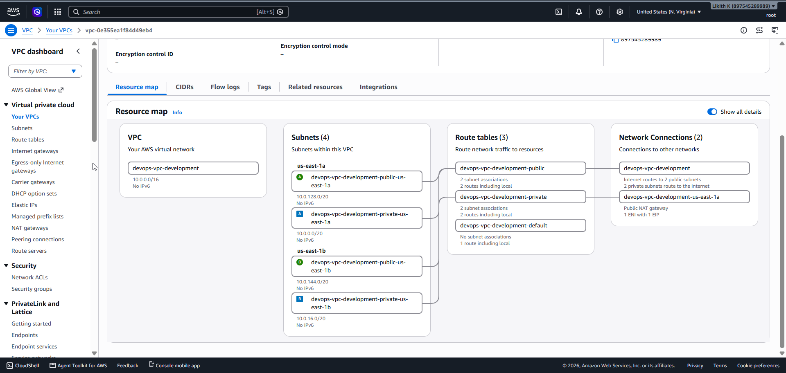
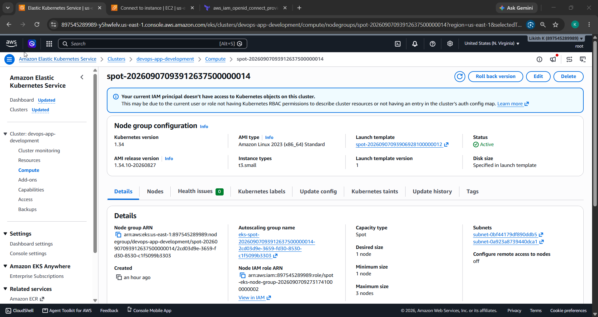
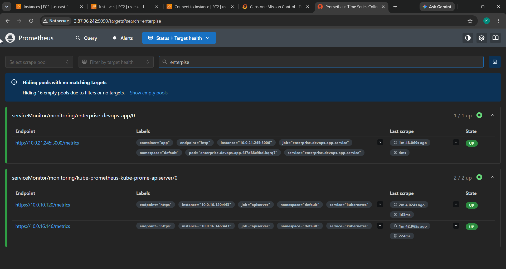

# System Design

This document describes the architecture that is actually provisioned by the
Terraform, Helm, and Kubernetes manifests in this repository, and the reasoning
behind the key decisions.

## High-level overview

```
                          Internet
                              │
                              ▼
              ┌──────────────────────────────┐
              │  Application Load Balancer    │  (internet-facing, created by the
              │  (AWS LB Controller + Ingress)│   AWS Load Balancer Controller)
              └──────────────┬───────────────┘
                             │ target-type: ip → pod IPs
        ┌────────────────────┼────────────────────────────────┐
        │  EKS cluster (Kubernetes 1.34)                       │
        │                                                      │
        │   Ingress ──► Service (ClusterIP :80 → :3000)        │
        │                 │                                    │
        │                 ▼                                    │
        │   Deployment: enterprise-devops-app (2 replicas)     │
        │     • non-root (uid 1001), drop ALL caps             │
        │     • /health probes, /metrics endpoint              │
        │     • HPA (CPU 70%), PDB (minAvailable 1)            │
        │                 │                                    │
        │                 ▼                                    │
        │   In-cluster Redis (Deployment + ClusterIP Service)  │
        │                                                      │
        │   ServiceMonitor ──► kube-prometheus-stack           │
        │     (Prometheus scrape → Grafana dashboards)         │
        └──────────────────────────────────────────────────────┘
                             │
     EKS-managed node group: SPOT t3.small (min 1 / desired 2 / max 3)
                             │
        ┌────────────────────┴────────────────────┐
        │  VPC (10.0.0.0/16), 2 AZs                │
        │  public subnets ──► single NAT gateway   │
        │  private subnets ──► worker nodes        │
        └──────────────────────────────────────────┘
```

## Network — VPC

Provisioned by `terraform/modules/vpc` (wrapping `terraform-aws-modules/vpc`):

- CIDR `10.0.0.0/16` across **two availability zones** (`us-east-1a`, `us-east-1b`).
- Public and private subnets per AZ. Public subnets are tagged
  `kubernetes.io/role/elb` and private subnets `kubernetes.io/role/internal-elb`
  so the AWS Load Balancer Controller can auto-discover where to place load balancers.
- Worker nodes run in the **private** subnets; egress to the internet (ECR pulls,
  package registries, external API calls) goes through a NAT gateway.

**Decision — single NAT gateway.** `single_nat_gateway = true`. A NAT gateway per AZ
would be more highly available, but each one costs roughly $32/month plus data
processing. For a cost-conscious capstone environment a single shared NAT is the right
trade-off (~$64/month saved versus one-per-AZ). The accepted downside is that an AZ
outage taking down the NAT would cut egress for the whole cluster.



## Compute — EKS

Provisioned by `terraform/modules/eks` (wrapping `terraform-aws-modules/eks ~> 20.0`):

- **Kubernetes 1.34**, public API endpoint enabled (no bastion/VPN in this
  environment), IRSA enabled, and the cluster-creator granted admin so `kubectl`
  works immediately after `apply`.
- Core addons managed by EKS: `coredns`, `kube-proxy`, `vpc-cni`. The EBS CSI driver
  is intentionally left out — nothing in the app uses PersistentVolumeClaims, and the
  addon would need its own IRSA role for no benefit here.
- One **EKS-managed node group** of **SPOT `t3.small`** instances, `min_size = 1`,
  `desired_size = 2`, `max_size = 3`.

**Decision — SPOT instances.** `capacity_type = "SPOT"` gives roughly 70% off
on-demand pricing. The workload is stateless and fronted by an HPA + PodDisruptionBudget,
so it tolerates the occasional spot reclamation without user-visible downtime.

**Decision — `t3.small` with desired_size 2.** A single `t3.small` can only run
about 11 pods (the ENI/IP limit imposed by the AWS VPC CNI). Once the full
kube-prometheus-stack (Prometheus, Alertmanager, node-exporter, kube-state-metrics,
Grafana) is added alongside the app, Redis, and the LB controller, one node isn't
enough — so the desired count was bumped from 1 to 2. See
[troubleshooting](../troubleshooting/common-issues.md) for the symptom this fixed.



## Ingress & load balancing

The app's Helm chart (`helm/saas-app`) defines an `Ingress` with `ingressClassName: alb`
and annotations:

- `alb.ingress.kubernetes.io/scheme: internet-facing`
- `alb.ingress.kubernetes.io/target-type: ip` — the ALB targets pod IPs directly
- `alb.ingress.kubernetes.io/healthcheck-path: /health`

The **AWS Load Balancer Controller** (installed via Helm, backed by an IRSA role from
`terraform/lb-controller-irsa.tf`) watches this Ingress and creates/updates the real
ALB, target groups, and health checks in AWS. The controller's ability to create AWS
resources is why teardown has to delete the Ingress *before* `terraform destroy` — see
troubleshooting.

The Service in front of the Deployment is a plain `ClusterIP` (`:80 → :3000`).

## Container security posture

The Helm Deployment and the raw manifests enforce a **restricted** PodSecurity posture:

- `runAsNonRoot: true`, `runAsUser: 1001`, `fsGroup: 1001`
- `allowPrivilegeEscalation: false`
- `capabilities: drop: ["ALL"]`
- `seccompProfile: type: RuntimeDefault`

The Docker image (`app/src/Dockerfile`) reinforces this: a multi-stage build that runs
as UID 1001, strips npm/npx/corepack out of the runtime layer to shrink the CVE surface,
and uses `dumb-init` as PID 1.

**Decision — restricted PodSecurity.** Running as a locked-down non-root user with no
Linux capabilities is the baseline required to pass the Trivy image scan (which fails CI
on CRITICAL/HIGH) and to satisfy the `restricted` Pod Security Standard. A `NetworkPolicy`
(`k8s/network-policy.yaml`) further limits pod traffic to the app port, Redis, the
monitoring namespace, and outbound 80/443 (with the instance metadata endpoint blocked).

## Data — Redis

Redis runs **in-cluster** (`k8s/redis-deployment.yaml`): a 2-replica Deployment with
pod anti-affinity, a ConfigMap-mounted `redis.conf` (LRU eviction, AOF persistence to an
`emptyDir`), and a `redis-service` ClusterIP the app reaches at
`redis://redis-service:6379`.

**Decision — in-cluster Redis instead of ElastiCache.** Terraform *can* provision an
ElastiCache cluster, but it is gated behind `enable_redis` which defaults to `false`.
A managed `cache.t3.micro` ElastiCache node runs continuously and adds meaningful
monthly cost; the app uses Redis as a best-effort cache (protected by a circuit breaker),
so an in-cluster Redis is sufficient and effectively free on top of the existing nodes.
The ElastiCache path remains available for a production upgrade by flipping the flag.

## Observability

`monitoring/servicemonitor.yaml` defines a `ServiceMonitor` (in the `monitoring`
namespace, labelled `release: kube-prometheus`) that selects the app Service and scrapes
its `/metrics` endpoint every 15s. The app exposes Prometheus metrics via `prom-client`
(default process metrics plus `http_requests_total` and `http_request_duration_seconds`).
The **kube-prometheus-stack** provides Prometheus (scraping) and Grafana (dashboards);
CloudWatch alarms and an SNS topic (defined in `terraform/main.tf`) cover cluster-level
CPU/memory alerting.



## Secrets & identity

- **GitHub Actions → AWS** authenticates via **OIDC** (`terraform/oidc.tf`); no
  long-lived AWS keys are stored in GitHub. The deploy role trusts the repository's OIDC
  subject and is granted ECR push, EKS describe, and scoped Terraform-state permissions.
- **App → AWS** uses **IRSA**: the `enterprise-devops-app` service account assumes an IAM
  role scoped to reading its Secrets Manager secret and publishing CloudWatch metrics.
- The Redis auth token is generated by Terraform (`random_password`) and stored in
  **AWS Secrets Manager**, not baked into the image.

## Related documents

- [Deployment Guide](../deployment/deployment-guide.md)
- [Getting Started](../development/getting-started.md)
- [Troubleshooting](../troubleshooting/common-issues.md)
- [Cost Optimization Report](../cost-optimization-report.md)
