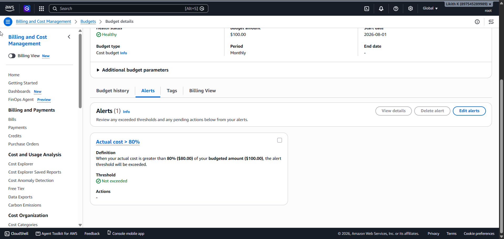

# Cost Optimization Report

This report documents the cost decisions actually implemented in this project's
Terraform, Helm, and Kubernetes configuration, and how they keep spend inside the
**$100/month** budget.

## Budget & guardrail

Terraform provisions an AWS Budget (`aws_budgets_budget.monthly` in `terraform/main.tf`)
with a **$100 USD monthly** limit and an email alert when **actual cost exceeds 80%
($80)**. As of the last check the budget is **Healthy — threshold not exceeded**.

## Estimated monthly cost (running 24/7)

Approximate `us-east-1` list prices for the stack as configured. Actual spend is lower
because the environment is torn down when idle (see below).

| Component                        | Configuration                              | Est. $/month |
|----------------------------------|--------------------------------------------|--------------|
| EKS control plane                | 1 cluster @ $0.10/hr                        | ~$73         |
| Worker nodes                     | 2 × `t3.small` **SPOT**                     | ~$9          |
| NAT gateway                      | **single** shared NAT                      | ~$32         |
| Application Load Balancer        | **one** shared ALB                         | ~$17         |
| Redis                            | in-cluster (`enable_redis = false`)        | $0           |
| ECR / S3 state / Secrets / misc  | with lifecycle policy + small footprint    | ~$3          |
| **Total (if left running)**      |                                            | **~$134**    |

> The EKS control plane and NAT gateway are the two largest fixed costs and cannot be
> optimized away while the cluster exists — which is exactly why the teardown-when-idle
> habit (below) matters most.

## Optimizations implemented

### 1. SPOT worker nodes (~70% off on-demand)
The managed node group uses `capacity_type = "SPOT"` (`terraform/modules/eks/main.tf`,
driven by `node_groups.*.spot = true`). SPOT `t3.small` instances run at roughly **70%
below on-demand**, taking 2 nodes from ~$30/month on-demand to ~$9/month. The workload is
stateless and protected by an HPA + PodDisruptionBudget, so spot reclamation is tolerated.

### 2. Single NAT gateway (~$64/month saved)
`single_nat_gateway = true` (`terraform/main.tf`) routes all private-subnet egress through
**one** NAT gateway instead of one per AZ. At ~$32/month each, this saves ~$64/month versus
a per-AZ setup. The trade-off — reduced AZ isolation for egress — is acceptable for a
non-production environment.

### 3. One shared ALB
A single internet-facing ALB (created by the AWS Load Balancer Controller from the app's
Ingress) fronts the application, rather than a load balancer per service. ~$17/month.

### 4. In-cluster Redis instead of ElastiCache
`enable_redis = false` (`terraform/terraform.tfvars`) keeps Redis running as an in-cluster
Deployment (`k8s/redis-deployment.yaml`) on the existing nodes instead of a managed
ElastiCache node. This avoids a continuously-billed `cache.t3.micro` (~$12/month) for **$0**
additional cost. The ElastiCache path stays available behind the flag for a production upgrade.

### 5. ECR lifecycle policy
`aws_ecr_lifecycle_policy.app_lifecycle` (`terraform/main.tf`) automatically **expires
untagged images after 7 days** and **keeps only the last 30 images**. Since the CD pipeline
pushes an image per commit, this caps ECR storage growth instead of letting it accumulate
indefinitely.

### 6. Teardown-when-idle habit
The biggest fixed costs (EKS control plane ~$73/month, NAT ~$32/month) accrue whenever the
cluster is up, regardless of traffic. Running `scripts/teardown.sh` when the environment
isn't in use destroys the billable infra (EKS, nodes, NAT, ALB) while **leaving the S3
state bucket, DynamoDB lock table, and budget in place** (near-zero cost), so the stack can
be recreated on demand with `scripts/bootstrap.sh`. This is what keeps actual monthly spend
comfortably under the $100 budget.

## Additional cost-aware choices

- **No EBS CSI driver / no PersistentVolumes** — the app is stateless and Redis uses an
  `emptyDir`, so no EBS volumes are provisioned.
- **Right-sized requests/limits** — dev pods request as little as 50m CPU / 96Mi memory
  (`helm/saas-app/values-dev.yaml`), fitting more onto each `t3.small`.
- **Cost allocation tags** — every resource is tagged `Project`, `Environment`, `ManagedBy`,
  and `CostCenter` via provider `default_tags` for spend attribution.

## Summary

| Lever                          | Status |
|--------------------------------|--------|
| SPOT worker nodes              | ✅ Implemented |
| Single NAT gateway             | ✅ Implemented |
| One shared ALB                 | ✅ Implemented |
| In-cluster Redis (no ElastiCache) | ✅ Implemented |
| ECR lifecycle policy           | ✅ Implemented |
| Teardown when idle             | ✅ Habit / scripted |
| $100 budget + 80% alert        | ✅ Implemented |
