# Deployment Guide

This describes how the application is actually deployed to EKS — both the automated
CI/CD path and how to deploy or roll back manually.

## CI/CD overview

Two workflows drive delivery (see `.github/workflows/`):

- **`ci.yml`** runs on PRs to `main`/`develop` and on pushes to `develop`. It lints,
  runs unit + integration tests (against a `redis:7-alpine` service container), runs a
  Snyk dependency scan, builds the image, and scans it with Trivy (fails on CRITICAL/HIGH)
  and Hadolint. Nothing is deployed from CI.
- **`cd.yml`** runs on pushes to `develop` (→ development) and `main` (→ production).

```
push to develop ──► CD: deploy-dev ──────────────► development environment (auto)
push to main ─────► CD: deploy-production ──►[approval]──► production environment
```

The CI workflow (`test` → `build`, with `security` in parallel) passing on a PR:

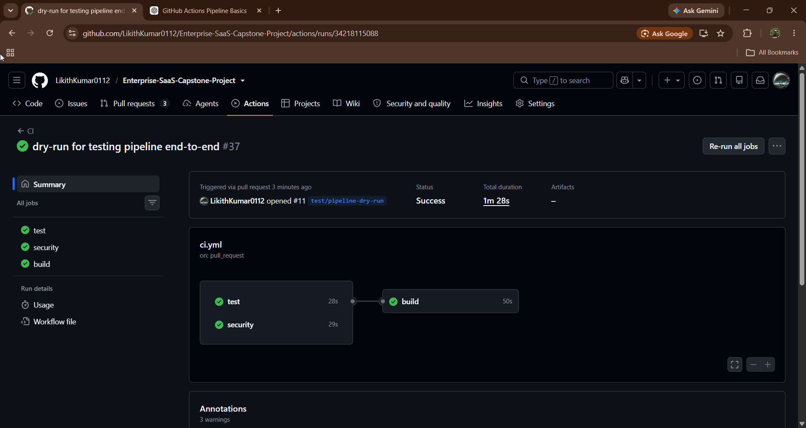

CI green on the PR into `develop`:

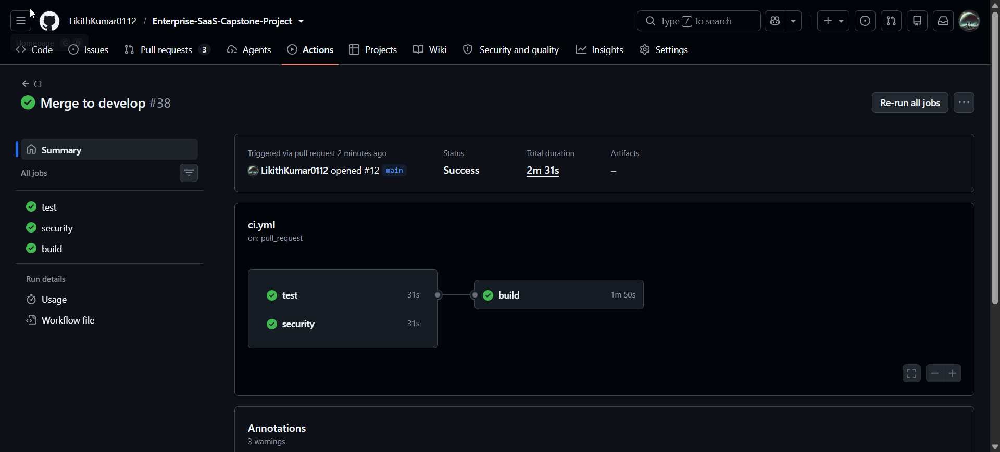

### Secret scanning (pre-commit)

Beyond the pipeline, `gitleaks` is wired into `.pre-commit-config.yaml` (alongside
`terraform_fmt`/`tflint`/`tfsec`) so secrets are caught before they're ever committed:

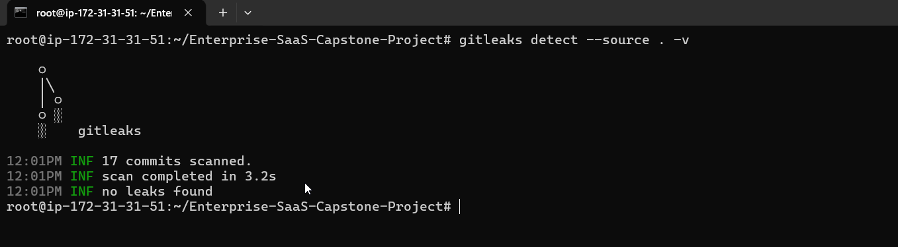

## How the CD pipeline deploys

The `deploy-dev` job in `.github/workflows/cd.yml`:

1. **Assumes an AWS role via OIDC.** `aws-actions/configure-aws-credentials` exchanges
   the GitHub OIDC token for temporary AWS credentials by assuming
   `secrets.AWS_DEPLOY_ROLE_ARN`. No static AWS keys are stored in GitHub.
2. **Logs in to ECR** with `aws-actions/amazon-ecr-login`.
3. **Builds and pushes the image** to
   `.../enterprise-devops-app-development`, tagged with the commit SHA
   (`github.sha`):
   ```bash
   IMG=$REGISTRY/enterprise-devops-app-development
   docker build -t $IMG:$GITHUB_SHA ./app/src
   docker push $IMG:$GITHUB_SHA
   ```
   The images accumulate in ECR (governed by the lifecycle policy — untagged expire after
   7 days, last 30 kept):

   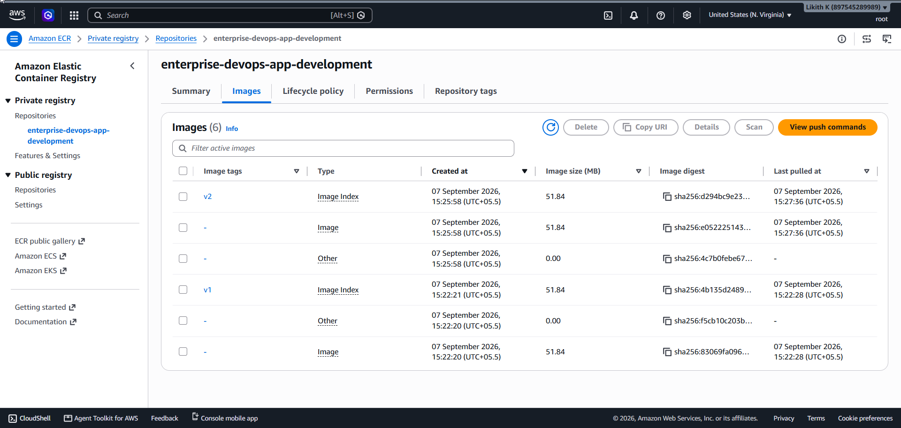
4. **Deploys with Helm.** It updates kubeconfig, then runs an idempotent
   `helm upgrade --install` using the dev values file, overriding the image, and
   **waits** for resources to become ready:
   ```bash
   aws eks update-kubeconfig --name $EKS_CLUSTER_NAME_DEV --region $AWS_REGION
   helm upgrade --install saas-app ./helm/saas-app -n default \
     -f ./helm/saas-app/values-dev.yaml \
     --set image.repository=$REGISTRY/enterprise-devops-app-development \
     --set image.tag=$GITHUB_SHA --wait --timeout 5m
   ```
5. **Smoke test + auto-rollback.** It checks the rollout status and, if the new
   ReplicaSet doesn't become healthy in time, **rolls back to the previous release**:
   ```bash
   kubectl rollout status deployment/enterprise-devops-app -n default --timeout=180s \
     || { echo "Rollout failed — rolling back"; helm rollback saas-app -n default; exit 1; }
   ```

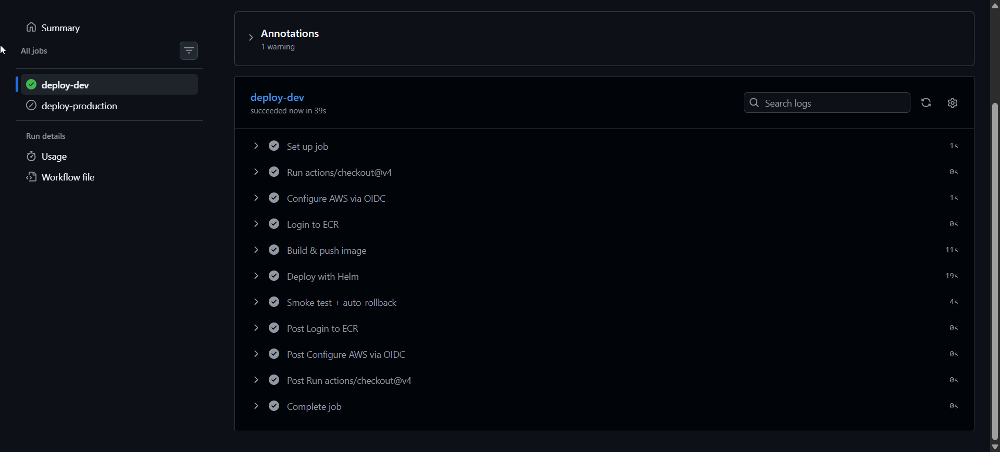

### Production

The `deploy-production` job is identical in shape but runs against the GitHub
**`production` environment**, which is configured with a required reviewer. That means a
push to `main` **pauses for manual approval** before it builds, pushes, and deploys:

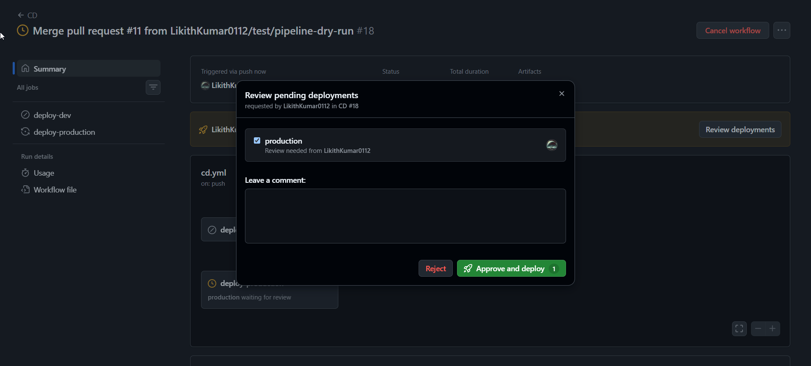

After approval, the production job runs to completion:

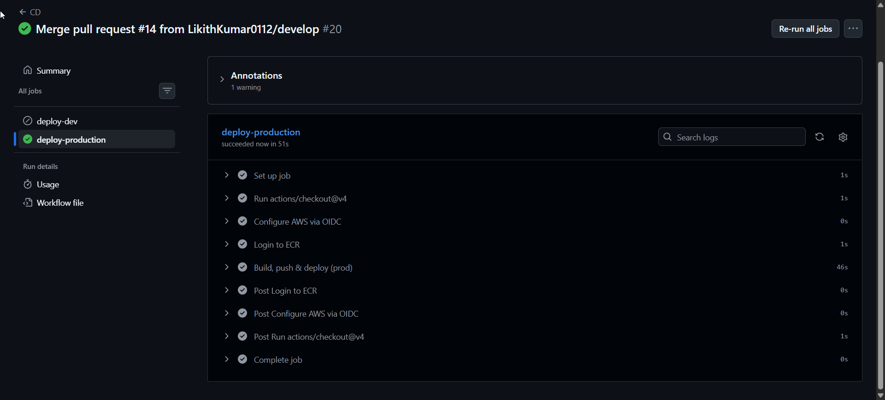

## Prerequisites for a manual deploy

- `aws`, `kubectl`, and `helm` installed and on `PATH`
- AWS credentials with access to the cluster (the CI deploy role, or your own admin)
- kubeconfig pointed at the cluster:

  ```bash
  aws eks update-kubeconfig --name devops-app-development --region us-east-1
  ```

## Manual deploy

Deploy a specific image tag (a commit SHA that exists in ECR):

```bash
# Get the ECR repository URL from Terraform outputs
ECR_URL=$(cd terraform && terraform output -raw ecr_repository_url)

helm upgrade --install saas-app ./helm/saas-app -n default \
  -f ./helm/saas-app/values-dev.yaml \
  --set image.repository=$ECR_URL \
  --set image.tag=<commit-sha> \
  --wait --timeout 5m
```

For production, use the prod values file instead:

```bash
helm upgrade --install saas-app ./helm/saas-app -n default \
  -f ./helm/saas-app/values-prod.yaml \
  --set image.repository=$ECR_URL \
  --set image.tag=<commit-sha> \
  --wait --timeout 5m
```

A manual `helm upgrade` bumping the image to `v3` — Helm reports the release upgraded to
revision 3:

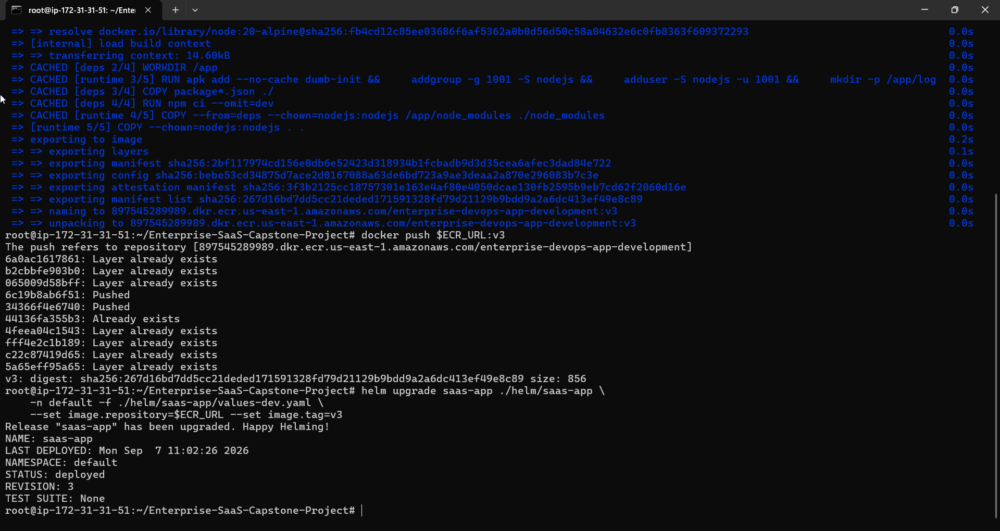

Because the Deployment uses a rolling update, the ALB keeps serving throughout — the app
responds with the new `v3` build and zero downtime:

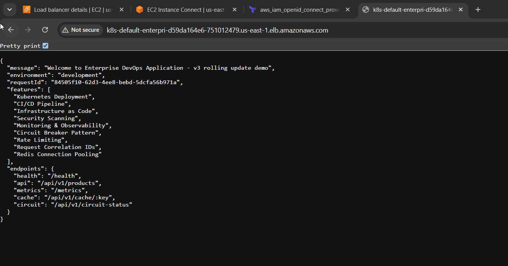

The `scripts/bootstrap.sh` helper provisions the cluster and prints the exact deploy
command for a fresh environment.

## Provisioning the infrastructure

Infrastructure is provisioned with Terraform (S3-backed remote state). `terraform plan`
shows the full set of resources to be created:

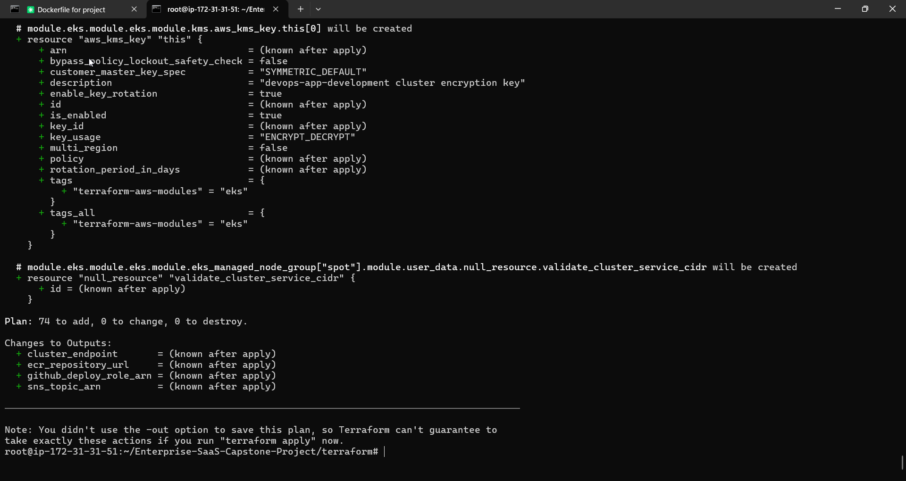

`terraform apply` reconciles the stack (here reporting no drift):

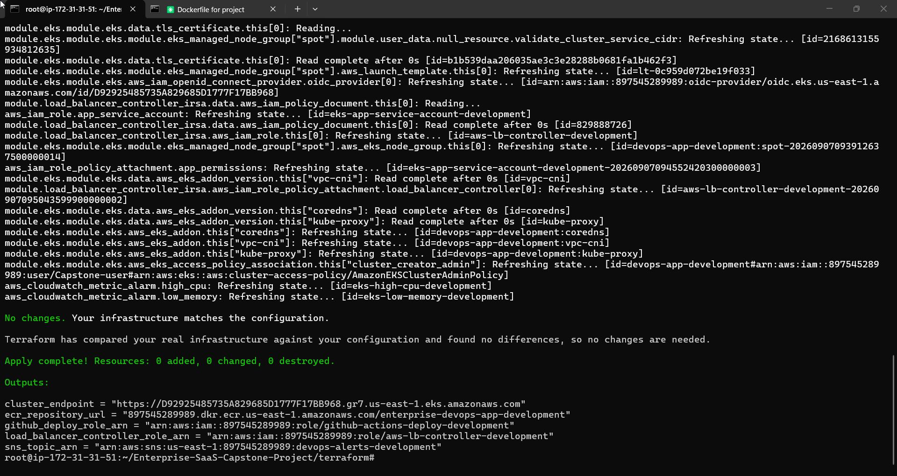

State is stored remotely in S3 (locked via DynamoDB), not on the local disk:

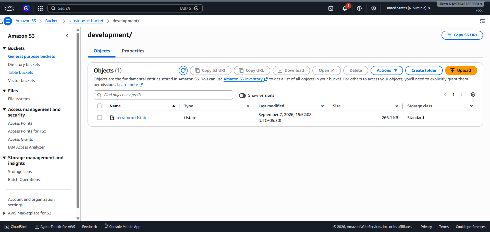

## Verifying a deploy

```bash
kubectl rollout status deployment/enterprise-devops-app -n default
kubectl get pods,svc,ingress,hpa -n default
helm history saas-app -n default
```

The `ADDRESS` on the Ingress is the ALB DNS name; `curl http://<alb-dns>/health` should
return healthy.

Kubernetes self-heals: deleting a pod while under load, the Deployment immediately
recreates it to maintain the desired replica count:

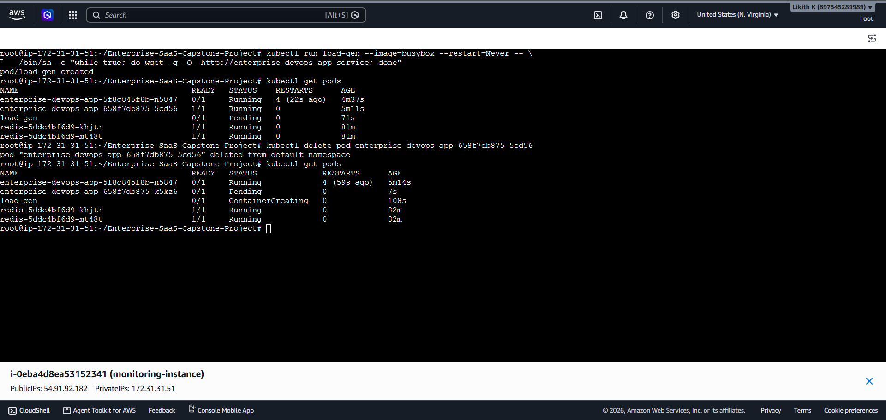

## Rolling back

Helm keeps release history, so rollback is one command:

```bash
helm history saas-app -n default          # find the last good REVISION
helm rollback saas-app <revision> -n default
# or roll back to the immediately previous release:
helm rollback saas-app -n default
```

This is the same command the CD pipeline runs automatically when a rollout fails its
smoke test.

`kubectl rollout history` / `rollout undo` achieve the same at the Deployment level
(note `--to-revision` is the correct flag, not `--to-version`):

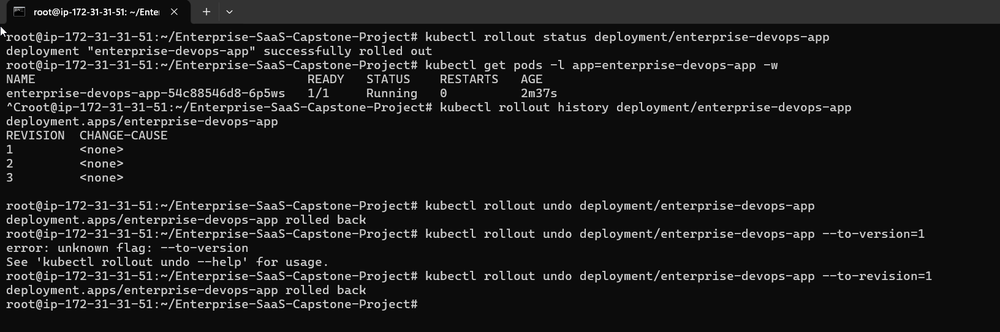

## Teardown

To destroy the billable infrastructure, use the teardown script — it deletes the
Ingress first so the AWS Load Balancer Controller removes the ALB before Terraform tries
to delete the VPC:

```bash
./scripts/teardown.sh
```

## Related documents

- [System Design](../architecture/system-design.md)
- [Branching Strategy](../branching-strategy.md)
- [Troubleshooting](../troubleshooting/common-issues.md)
