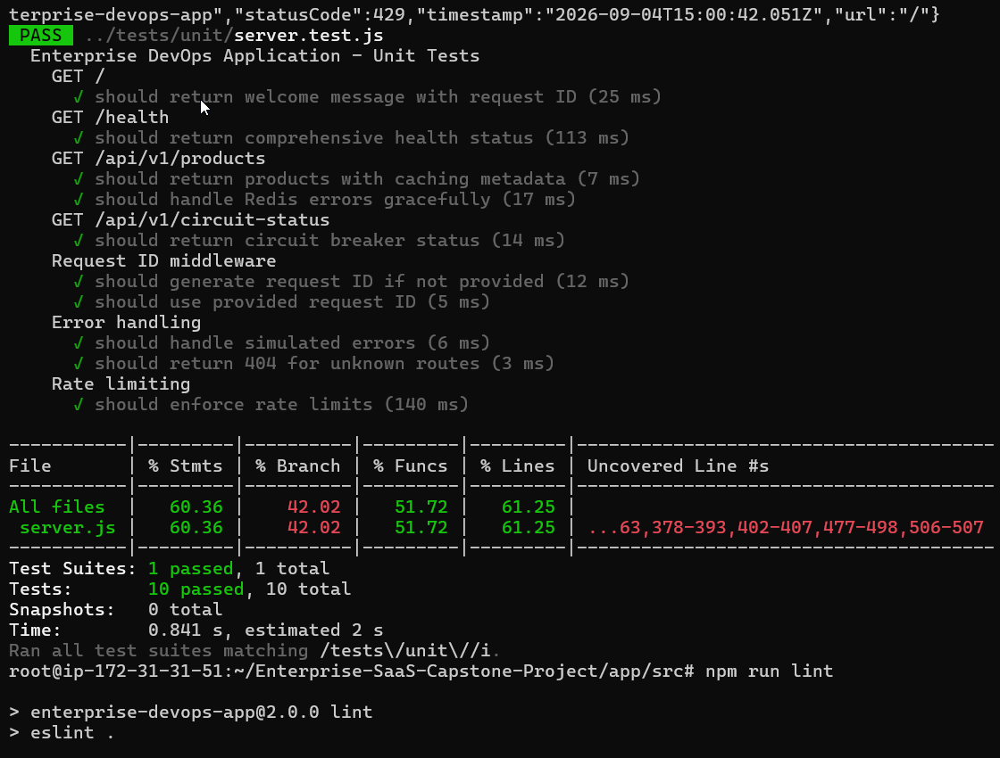
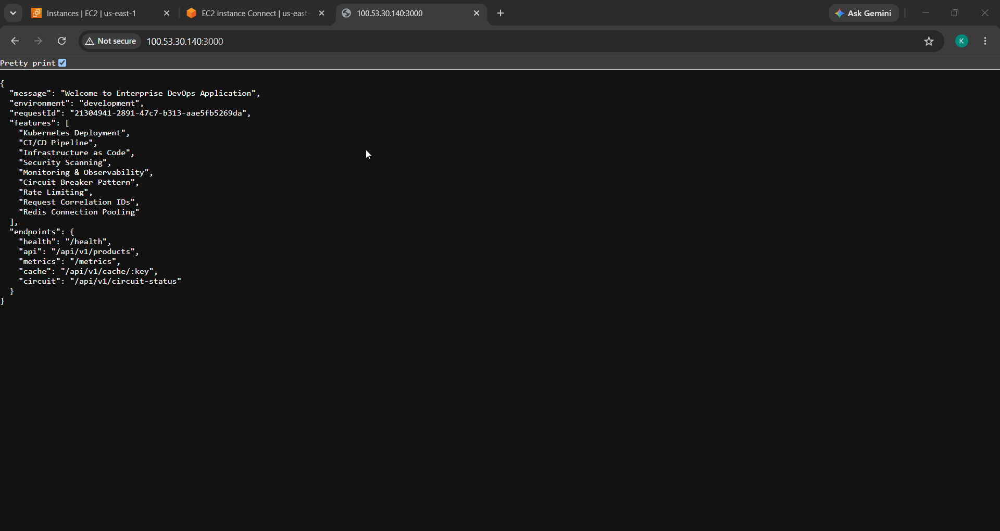
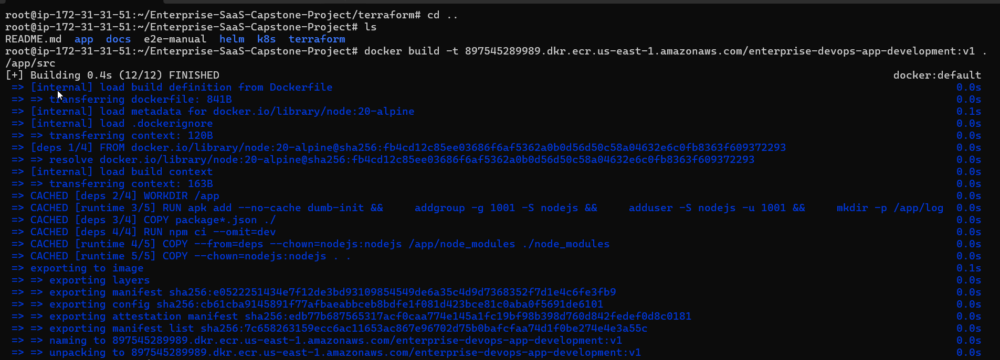

# Getting Started (Local Development)

How to run and test the application on your own machine. Everything below assumes
you are working inside the app directory:

```bash
cd app/src
```

## Prerequisites

- **Node.js 20+** and **npm 9+** (the app declares `engines: node >=18`, and CI runs on Node 20)
- **Docker** (for running Redis locally and building the image)

## 1. Install dependencies

```bash
npm install
```

## 2. Configure environment

Copy the example file and adjust values as needed:

```bash
cp .env.example .env
```

The defaults in `.env.example` are:

```
NODE_ENV=development
PORT=3000
LOG_LEVEL=info
REDIS_URL=redis://localhost:6379
EXTERNAL_API_URL=https://api.mocki.io/v2/5143e9e3
APP_VERSION=2.0.0
ALLOWED_ORIGINS=http://localhost:3000
```

## 3. Run unit tests

Unit tests do not need Redis. They run with coverage (thresholds are enforced by the
Jest config in `package.json`):

```bash
npm test
```



## 4. Run integration tests

Integration tests exercise the cache endpoints and **require a Redis instance** on
`localhost:6379`. Start one with Docker:

```bash
docker run -d --name dev-redis -p 6379:6379 redis:7-alpine
```

Then run the suite:

```bash
npm run test:integration
```

When you're done:

```bash
docker rm -f dev-redis
```

> This mirrors CI: the `test` job in `.github/workflows/ci.yml` spins up a
> `redis:7-alpine` service container and runs the integration tests against
> `redis://localhost:6379`.

## 5. Run the app locally

With Redis running (step 4) and a `.env` in place:

```bash
npm start        # node src/server.js
# or, with auto-reload:
npm run dev
```

The server listens on `http://localhost:3000`. Useful endpoints:

- `GET /health` — health check (used by container/K8s probes and the ALB)
- `GET /metrics` — Prometheus metrics
- `GET/POST/DELETE /api/v1/cache/:key` — Redis-backed cache API

The root endpoint returns app metadata (environment, request ID, feature list, endpoints):



## 6. Build and run the Docker image

The app ships a multi-stage `Dockerfile`. Build and run it with the provided npm scripts:

```bash
npm run docker:build           # docker build -t enterprise-devops-app .
npm run docker:run             # docker run -p 3000:3000 --env-file .env enterprise-devops-app
```

Or directly:

```bash
docker build -t enterprise-devops-app .
docker run -p 3000:3000 --env-file .env enterprise-devops-app
```

The image runs as a non-root user (UID 1001) with `dumb-init` as PID 1 and a built-in
`HEALTHCHECK` hitting `/health`.

The multi-stage build (`deps` → `runtime`) in action:



## Handy scripts

| Command                     | What it does                                  |
|-----------------------------|-----------------------------------------------|
| `npm test`                  | Unit tests with coverage                      |
| `npm run test:integration`  | Integration tests (needs Redis)               |
| `npm run test:e2e`          | End-to-end / load tests                       |
| `npm run lint`              | ESLint                                        |
| `npm run lint:fix`          | ESLint with autofix                           |
| `npm run security-check`    | `npm audit --audit-level=critical`            |
| `npm run docker:build`      | Build the container image                     |
| `npm run docker:run`        | Run the container image                        |

## Next steps

- [System Design](../architecture/system-design.md) — how it all fits together on AWS
- [Deployment Guide](../deployment/deployment-guide.md) — how CI/CD ships it
- [Troubleshooting](../troubleshooting/common-issues.md) — issues we actually hit
